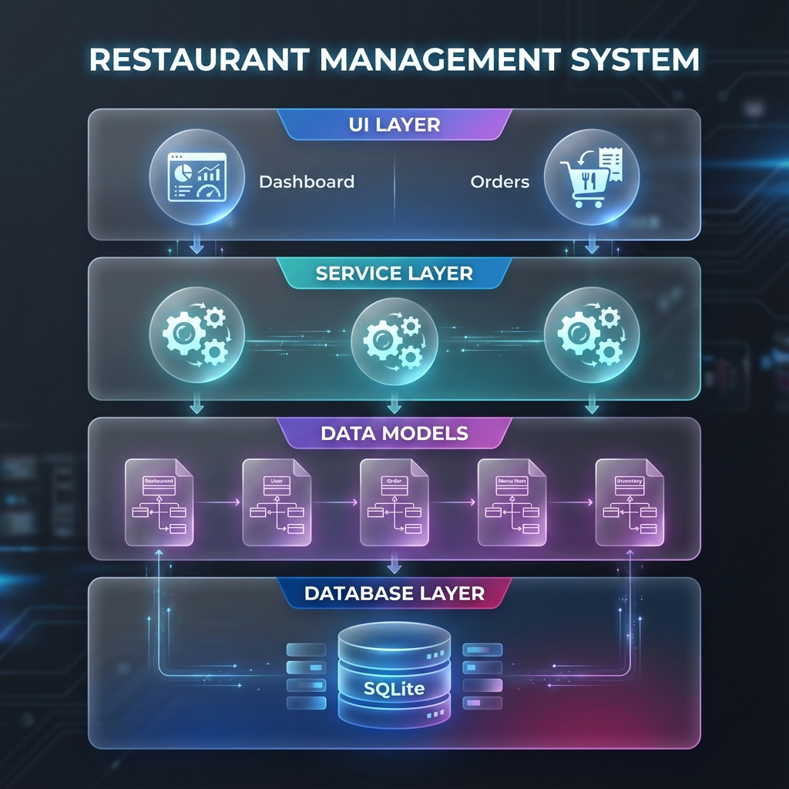
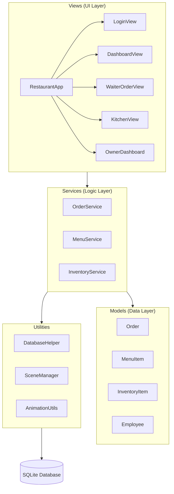

# Restaurant Management System - Project Analysis Report

This report provides a detailed breakdown of the "RESTAURANT" project, a professional Point of Sale (POS) application built with Java and JavaFX.

## 🏗️ System Architecture

The project follows a modular architecture that resembles the Model-View-Controller (MVC) pattern, emphasizing separation of concerns between data, UI, and business logic.

---

## 🛠️ Technology Stack

- **Language**: Java 21
- **UI Framework**: JavaFX 21
- **Persistence**: SQLite (via JDBC)
- **Build Tool**: Maven
- **Design**: Modern UI with glassmorphism effects, custom CSS, and smooth animations.

---

## 📂 Core Components

### 1. The Entry Point: `RestaurantApp.java`
Handles application lifecycle, role-based login (Owner, Waiter, Front Desk), and main navigation logic. It uses a `BorderPane` with a dynamic sidebar for the main dashboard.

### 2. Data Persistence: `DatabaseHelper.java`
Manages the SQLite database connection and initializes tables for:
- `menu_items`: Storage for restaurant offerings.
- `orders`: Active and historical order tracking.
- `inventory`: Stock management data.

### 3. Business Logic: `Services`
Uses the Singleton pattern to provide centralized data management:
- **`OrderService`**: Manages the lifecycle of an order from placement to completion.
- **`MenuService`**: Handles menu data and categorization.
- **`InventoryService`**: Monitors stock levels and supplies.

---

## ✨ Key Features

1. **Role-Based Access Control**: Different views and permissions for Owners, Waiters, and Receptionists.
2. **Interactive Order Management**: `WaiterOrderView` allows real-time order placement with automatic price calculation and bill generation.
3. **Kitchen Sync**: Real-time display of pending orders for the kitchen staff.
4. **Analytics Dashboard**: Financial reports and sales statistics (e.g., total revenue, popular items).
5. **Modern UX**: Extensive use of `AnimationUtils` for fades, slides, and pulses, making the application feel responsive and premium.

---

## 📈 Code Quality & Best Practices
- **Singleton Pattern**: Ensures services are globally accessible without redundant database connections.
- **Observable Pattern**: Uses JavaFX properties and `ObservableList` for automatic UI updates when data changes.
- **Service Layer**: Decouples UI controllers from database logic, improving maintainability.
- **Custom Styling**: Uses external CSS files for a consistent "Enterprise Edition" look.

---

## 📝 Observations
- The codebase is clean, well-commented, and follows standard Java naming conventions.
- Transition from legacy text-based storage to SQLite is evident and improves data integrity.
- The UI is highly polished with dedicated components like `Sidebar` for navigation.
